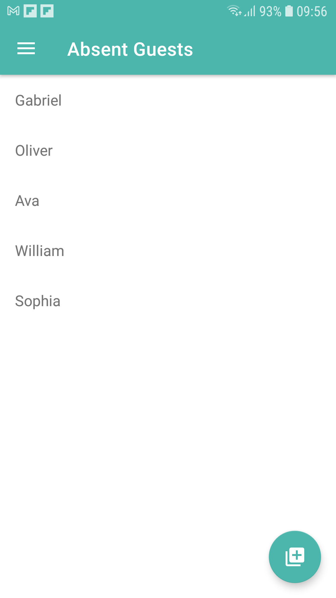

<h1 align="center">
    Guests with Room
</h1>

<p align="center">
   <a href="https://github.com/VictorGabrielMS">
    
  </a>
</p>

<p align="center">
  <a href="https://developer.android.com/?hl=pt-br">
    
  </a>
  <a href="https://kotlinlang.org/">
    
  </a>
</p>

## Guests

- [Guests](#guests)
- [:interrobang: About](#interrobang-about)
- [:sparkles: The Application](#sparkles-the-application)
- [:diamonds: Techs/Concepts](#diamonds-techsconcepts)
- [:octocat:Clone this repo](#octocatclone-this-repo)
- [:memo: License](#memo-license)

<a id="about"></a>

## :interrobang: About

<strong>Guests:</strong> a mobile app created to keep some kotlin concepts, a guest list that you can see present and absent guests.

<a id="application"></a>

## :sparkles: The Application


<h3 align="center">
    
    
    
    
    
</h3>

<a id="techs"></a>

## :diamonds: Techs/Concepts

The project was developed with the technologies below:

- [Kotlin](https://kotlinlang.org/)
- [Sqlite](https://www.sqlite.org/index.html)
- [Room](https://developer.android.com/jetpack/androidx/releases/room?gclid=CjwKCAjwp7eUBhBeEiwAZbHwkYstUPUCk5y1AQX1yVu6YCuEGhZaqbbPQobtntxL9ky3D1k3aeYCWhoCFdEQAvD_BwE&gclsrc=aw.ds)
- MVVM - Model-View-ViewModel
- View Binding
- Recycle Listing
- Solid
- Singleton Database Class

<a id="clone"></a>

## :octocat:Clone this repo

1. Clone :

```sh
  $ git clone https://github.com/VictorGabrielMS/guestapps.git
```

2. Then open the folder on Android Studio and execute

## :memo: License

This project is under MIT LICENSE. for more details follow the link: [LICENSE](LICENSE).